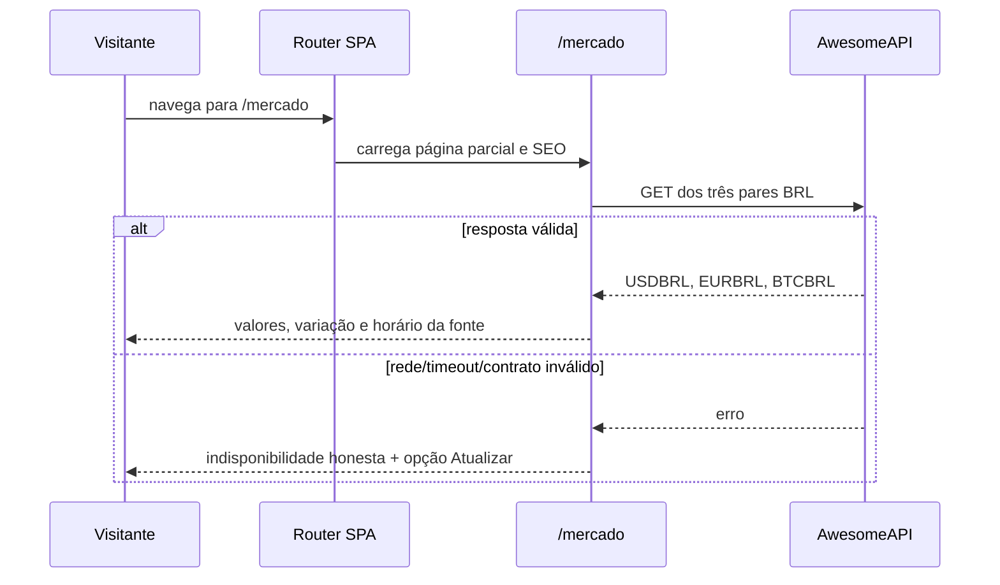

# Arquitetura Incremental — EPIC-11 Cotações Financeiras Públicas

**Status:** Ready for Dev
**Versão:** 1.0
**Data:** 2026-07-27
**Autor:** @architect
**Escopo:** Story 11.1 do `EPIC-11`

## 1. Estado atual e decisão de integração

A Miranda Soft é uma SPA estática em JavaScript vanilla. O router em `src/core/core.js` busca `src/pages/<slug>.html` apenas para slugs registrados em `src/config/config.js`; depois atualiza SEO pelo mapa de `src/config/seo.js`. `Dockerfile` usa `serve -s . -p 8080`, preservando deep links da SPA.

A rota existente `/cotacoes` é o formulário comercial de pedido de proposta. Ela é indexável e deve permanecer intacta. O incremento adotará a rota distinta `/mercado` e exibirá no menu o texto `Mercado`.

A integração de dados aprovada para esta story é a chamada browser-side CORS para:

`https://economia.awesomeapi.com.br/last/USD-BRL,EUR-BRL,BTC-BRL`

Evidência técnica coletada em 2026-07-27:

- resposta HTTP 200 com os objetos `USDBRL`, `EURBRL` e `BTCBRL`;
- cada objeto contém `bid`, `pctChange`, `timestamp` e `create_date`;
- `fetch` do navegador servido localmente retornou HTTP 200 com `type: "cors"`;
- não foi utilizada chave, token, proxy ou backend.

A disponibilidade e a precisão da fonte são externas; o produto deve representar falha sem fabricar dados.

## 2. Superfícies e contratos

| Responsabilidade | Arquivo | Alteração |
| --- | --- | --- |
| Página e estado de consulta | `src/pages/mercado.html` | Novo HTML parcial, CSS local e script isolado. |
| Registro da rota | `src/config/config.js` | Incluir `mercado` em `validPages`. |
| SEO | `src/config/seo.js` | Metadados indexáveis específicos da rota. |
| Descoberta | `src/components/header.html` | Link `Mercado` para `/mercado`, mantendo `Pedir cotação`. |
| Descoberta por crawler | `sitemap.xml` | URL canônica `/mercado`. |
| Cache do shell | `index.html`, `src/config/config.js` | Bump da mesma versão e query strings de scripts críticos. |
| Contrato de release | `tests/test_service_pages.py` | Testes estáticos de rota, SEO, sitemap, menu e fonte. |

Não haverá mudança em API interna, autenticação, armazenamento local, consentimento ou serviços existentes.

## 3. Contrato da fonte externa

### Request

- Método: `GET`
- URL: `https://economia.awesomeapi.com.br/last/USD-BRL,EUR-BRL,BTC-BRL`
- Credenciais: nenhuma; `fetch` usa o modo CORS padrão.
- Frequência: uma carga ao entrar na página e somente por clique explícito em atualizar; sem polling.
- Timeout: 10 segundos via `AbortController`.

### Response mínima esperada

```json
{
  "USDBRL": { "bid": "string-numérica", "pctChange": "string-numérica", "timestamp": "epoch-segundos", "create_date": "data-hora" },
  "EURBRL": { "bid": "string-numérica", "pctChange": "string-numérica", "timestamp": "epoch-segundos", "create_date": "data-hora" },
  "BTCBRL": { "bid": "string-numérica", "pctChange": "string-numérica", "timestamp": "epoch-segundos", "create_date": "data-hora" }
}
```

Valores inválidos, objeto ausente, resposta não OK, erro de rede ou timeout devem levar ao estado de falha. Nenhum dado externo é inserido por `innerHTML`.

## 4. Fluxo de interface



Estados permitidos:

- `loading`: cards mostram que a fonte está sendo consultada;
- `ready`: os três cards mostram somente dados validados;
- `error`: feedback `role="status"` descreve a indisponibilidade e o botão pode tentar novamente;
- `refreshing`: botão fica desabilitado para evitar concorrência.

A atualização manual conserva os últimos valores válidos visualmente enquanto busca novos dados, mas o feedback identifica a atualização em andamento. Se a primeira carga falhar, cards não exibem preço.

## 5. Formatação, acessibilidade e conteúdo

- Valores usam `Intl.NumberFormat('pt-BR', { style: 'currency', currency: 'BRL' })`.
- Variação usa sinal explícito e classe visual adicional; o texto contém o valor, não depende apenas de cor.
- Data/hora usa `Intl.DateTimeFormat('pt-BR')` a partir de `timestamp` em segundos, obrigatório, finito e positivo; o elemento `time` recebe também o atributo ISO `datetime`.
- A página terá um único `h1`, cards com títulos identificáveis, botão `Atualizar cotações` e uma região de status com `role="status"`.
- O rodapé da página identifica AwesomeAPI como fonte e declara finalidade informativa, sem afirmações de mercado em tempo real ou aconselhamento financeiro.

## 6. SEO, deploy, cache e rollback

`mercado` deve existir de modo consistente em `validPages`, `SEO_CONFIG` e `sitemap.xml`. Por ser uma página pública informativa, a entrada SEO terá `noindex: false`. A aplicação é cacheada por caminhos de configuração; portanto toda alteração de rota/SEO exige bump idêntico em:

- comentário de versão do `index.html`;
- `config.app.version`;
- query strings de `config.js`, `seo.js`, `consent.js`, `component.js`, `i18n.js`, `helpers.js`, `skeleton.js` e `core.js`.

O runtime de produção conhecido é `serve -s`, que deve responder ao deep link `/mercado` com a shell; o router então busca a página parcial.

Rollback: remover o link do header, a entrada de rota/SEO/sitemap e a página; restaurar o conjunto de versão anterior. `/cotacoes` não é afetada.

## 7. Estratégia de QA

1. Validar estaticamente rota, SEO, sitemap, link do menu, endpoint e ausência de colisão com `/cotacoes`.
2. Extrair e verificar a sintaxe do script inline com `node --check`.
3. Servir com `npx serve -s .`, testar `/mercado` por navegação interna e deep link.
4. No navegador, confirmar resposta CORS, carregamento, atualização manual, tratamento de falha interceptando `fetch`, título/description/canonical renderizados e ausência de erros no console.
5. Validar XML do sitemap, JSON do `serve.json`, `git -c core.whitespace=cr-at-eol diff --check` e escopo de arquivos. `index.html` usa CRLF intencionalmente; o override evita falsos positivos de CR como whitespace final.
6. Solicitar revisão independente somente-leitura antes de commit.

## 8. Riscos residuais

| Risco | Tratamento |
| --- | --- |
| Mudança de formato, indisponibilidade ou limite da fonte externa | Validar o contrato em runtime, usar timeout e não manter dados persistidos como se atuais. |
| Interpretação financeira indevida | Escopo sem negociação/conversor/alertas e aviso informativo explícito. |
| Regressão de rotas públicas por cache | Bump coordenado, teste de deep link e contrato estático. |
| Confusão de propósito com a página comercial | Slug e label distintos, preservação testada de `/cotacoes`. |
