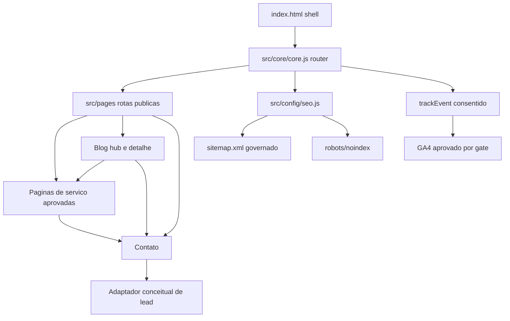

# m-site / Miranda Soft Brownfield Enhancement Architecture

**Status:** DRAFT / aguardando gates de negocio
**Versao:** 0.1
**Data:** 2026-07-26
**Autor:** @architect
**Escopo:** stories 9.2 a 9.5 do `EPIC-9`

## 1. Introducao

Este documento define a arquitetura incremental para evoluir o m-site em aquisicao organica e geracao de leads B2B sem reescrever a stack atual. O escopo parte exclusivamente do repositorio e respeita as restricoes do PRD draft, do epic draft e da SPA em JavaScript vanilla.

Relacao com a arquitetura existente:

- preserva `index.html` como shell principal;
- preserva `src/config/config.js` como ponto de verdade de rotas e configuracao frontend;
- preserva o roteamento SPA por `src/core/core.js` com fallback de servidor para `index.html`;
- preserva carregamento de paginas HTML em `src/pages/` e SEO dinamico em runtime;
- nao autoriza novo framework, build step, CRM, backend ou endpoint sem gate explicito.

## 2. Analise do Estado Atual

### 2.1 Estado atual do projeto

- **Primary Purpose:** site institucional e vitrine digital Miranda Soft com SPA publica, blog, rotas tematicas e areas auxiliares.
- **Current Tech Stack:** HTML, CSS, JavaScript vanilla, `serve -s` no container, assets estaticos, paginas HTML carregadas por fetch, API externa configuravel via `window.__MSOFT_API_BASE__`.
- **Architecture Style:** SPA estatica com roteamento client-side, paginas parciais em `src/pages/`, componentes HTML em `src/components/` e SEO dinamico no browser.
- **Deployment Method:** deploy estatico com fallback SPA (`Dockerfile` usa `serve -s . -p 8080`; `serve.json` aplica headers e cache).

### 2.2 Documentacao e evidencias usadas

- `docs/PRD/organic-acquisition-and-b2b-lead-generation.md`
- `docs/PRD/epic-9-aquisicao-organica-e-leads-b2b.md`
- `docs/research/organic-growth-ecosystem-2026.md`
- `docs/PRD/m-site.md`
- `.aiox-core/constitution.md`
- `.aiox-core/development/agents/architect.md`
- `.aiox-core/product/templates/brownfield-architecture-tmpl.yaml`
- `index.html`
- `src/config/config.js`
- `src/config/seo.js`
- `src/core/core.js`
- `src/pages/contact.html`
- `src/pages/blog.html`
- `src/pages/materials.html`
- `src/pages/support.html`
- `src/pages/terms.html`
- `src/data/blog-posts.js`
- `sitemap.xml`
- `robots.txt`
- `serve.json`
- `Dockerfile`

### 2.3 Evidencias tecnicas verificadas

- A shell publica ja publica `Organization`, `WebSite` e `LocalBusiness` JSON-LD em `index.html`.
- O SEO dinamico atualiza `title`, `description`, `canonical`, `robots`, `og:*` e `twitter:*` em `src/core/core.js` a partir de `src/config/seo.js`.
- O blog detalhado ja adiciona `Article` JSON-LD dinamico em `src/pages/blog.html`.
- O banner de consentimento e o carregamento condicional de GA4 ja existem em `index.html`, mas `analytics.enabled` esta `false` e o `ga4MeasurementId` e placeholder em `src/config/config.js`.
- `config.routes.validPages` contem rotas publicas centrais e perifericas, incluindo `blog-ads`, `blog-review`, `blogs`, `blog-custom`, `games`, `marketplace` e `apps`.
- `sitemap.xml` indexa varias dessas rotas perifericas.
- `robots.txt` apenas permite tudo e anuncia sitemap.
- `contact.html` simula envio com `setTimeout`, sem captura real.
- `materials.html`, `support.html`, `terms.html` e `src/data/blog-posts.js` ainda carregam narrativa legada de framework/demo.

### 2.4 Restricoes identificadas

- Manter SPA e roteamento atual (`NFR-001`, `CR-001`).
- Nao inventar portfolio, CTA, CRM, API, metricas, clientes ou provas (`FR-010`, `NFR-005`).
- Nao quebrar deep links nem depender de SSR/SSG nesta fase.
- Qualquer coleta analitica ou de lead precisa respeitar consentimento e LGPD (`NFR-002`).
- Rollback deve ser por superficie ou comportamento, nao por reescrita ampla (`NFR-004`).

### 2.5 Pontos reais de extensao

- `config.routes.validPages`: controlar novas rotas publicas ou desindexacao logica.
- `src/config/seo.js`: definir titulos, descriptions e `noindex` por rota.
- `src/core/core.js`: manter orquestracao SPA, canonical, `page_view`, estados de erro e tracking por `data-track`.
- `src/pages/*.html`: superficie principal para reestruturar conteudo, CTA, schema local e estados de formulario.
- `src/pages/blog.html`: hub/lista/detalhe dinamico, com base para linking interno e schema `Article`.
- `src/data/blog-posts.js`: fallback local e evidencia de backlog editorial legado.
- `index.html`: schema base, consentimento, Search Console, bootstrap de analytics.
- `sitemap.xml` e `robots.txt`: governanca de descoberta/indexacao.
- `serve.json` e `Dockerfile`: compatibilidade de cache, headers e fallback SPA.

## 3. Escopo da Melhoria e Estrategia de Integracao

### 3.1 Enhancement overview

**Enhancement Type:** brownfield enhancement substancial e incremental
**Scope:** stories 9.2 a 9.5 do epic 9
**Integration Impact:** medio para alto em conteudo, SEO, conversao e mensuracao; baixo em infraestrutura

### 3.2 Estrategia de integracao

- **Code Integration Strategy:** evoluir paginas e configuracoes existentes, sem criar camada paralela.
- **Database Integration:** nenhuma mudanca de schema autorizada nesta arquitetura.
- **API Integration:** apenas contrato conceitual para captura de lead; sem endpoint definido ate gate.
- **UI Integration:** reaproveitar o padrao de paginas parciais, CTA com `data-track`, componentes existentes e estilo atual.

### 3.3 Requisitos de compatibilidade

- **Existing API Compatibility:** nenhuma dependencia nova obrigatoria antes do gate de captura real.
- **Database Schema Compatibility:** nao aplicavel nesta fase.
- **UI/UX Consistency:** manter conventions atuais de `src/pages/`, Bootstrap local e shell atual.
- **Performance Impact:** evitar bibliotecas novas; limitar scripts inline e schemas por pagina ao necessario.

## 4. Alinhamento de Stack

| Categoria | Tecnologia atual | Versao | Uso no incremento | Notas |
| --- | --- | --- | --- | --- |
| Shell web | `index.html` estatico | repo atual | mantido | origem de meta base, schema base e scripts globais |
| Frontend | JavaScript vanilla | repo atual | mantido | sem framework novo |
| Roteamento | `src/core/core.js` | repo atual | mantido e estendido pontualmente | continua SPA com `history.pushState` |
| Configuracao | `src/config/config.js` | `0.11.64` | mantido | fonte de rotas, API base e analytics |
| SEO runtime | `src/config/seo.js` + `core.js` | repo atual | mantido e expandido | por rota publica |
| Conteudo | `src/pages/*.html` | repo atual | principal superficie | paginas comerciais e editoriais |
| Blog dinamico | `src/pages/blog.html` | repo atual | mantido | lista/detalhe e `Article` schema |
| Deploy | `serve -s` + `serve.json` + `Dockerfile` | repo atual | mantido | fallback SPA obrigatorio |

**Novas tecnologias:** nenhuma aprovada nesta arquitetura.

## 5. Arquitetura Incremental por Story

## 5.1 Story 9.2 - Restaurar arquitetura de conteudo confiavel

### Objetivo arquitetural

Reduzir conflito semantico e de confianca sem quebrar rotas publicas existentes.

### Componentes/superficies envolvidas

- `src/pages/blog.html`
- `src/data/blog-posts.js`
- `src/pages/materials.html`
- `src/pages/support.html`
- `src/pages/terms.html`
- `src/config/seo.js`
- `sitemap.xml`
- `robots.txt`
- possivelmente `src/components/header.html` e `src/components/footer.html` se a navegacao publica precisar refletir a politica aprovada para areas legadas

### Estrategia incremental

1. Classificar rotas publicas em tres grupos: pilar B2B, suporte legal/institucional e perifericas/legadas.
2. Para cada rota legada, aplicar uma das acoes aprovadas no gate DG-06:
   - corrigir conteudo;
   - manter rota com `noindex`;
   - retirar da navegacao mantendo acessibilidade direta;
   - remover do sitemap;
   - combinar as tres ultimas.
3. Blog deixa de atuar como demo de framework e passa a hub editorial B2B, mesmo antes do rollout volumetrico de 9.5.

### Politica arquitetural para rotas e conteudo

| Grupo | Rotas atuais | Politica default nesta arquitetura | Gate |
| --- | --- | --- | --- |
| Pilar B2B | `/`, `/about`, `/expertise`, `/ecossistema`, `/contact`, `/blog`, `/mcredential` | manter indexavel com narrativa coerente | DG-01 e DG-04 afetam copy e foco |
| Legal/institucional | `/privacy`, `/lgpd`, `/cookies`, `/terms` | manter publicas; `terms` exige saneamento editorial antes de seguir indexavel | DG-06 |
| Legadas/perifericas | `/materials`, `/support`, `/apps`, `/marketplace`, `/games`, `/blog-ads`, `/blog-review`, `/blogs`, `/blog-custom` | nao tratar como pilares sem decisao; candidatas a retirada de sitemap e/ou `noindex` | DG-06 |

### Entregaveis verificaveis para SM/PO

- matriz rota -> acao aprovada -> criterio de indexacao;
- checklist de conteudo legado removido ou isolado;
- lista de URLs que permanecem na navegacao global;
- lista de URLs que saem do sitemap;
- criterio de aceite para canonical, `noindex` e links internos por rota.

## 5.2 Story 9.3 - Estruturar paginas de servico aprovadas e metadados comerciais minimos

### Objetivo arquitetural

Adicionar a primeira camada de paginas comerciais sem alterar o modelo SPA.

### Precondicao

DG-01 aprovado. Sem portfolio comercial priorizado, esta story permanece bloqueada.

### Estrategia de rotas

Manter slugs curtos e aderentes ao roteador atual. A arquitetura nao fixa slugs definitivos sem aprovacao comercial, mas define o contrato de roteamento:

- cada nova pagina comercial deve existir como arquivo HTML em `src/pages/<slug>.html`;
- cada slug deve ser registrado em `config.routes.validPages`;
- cada slug deve possuir entrada dedicada em `src/config/seo.js`;
- cada slug aprovado deve entrar no `sitemap.xml`;
- cada pagina deve linkar para `/contact` ou outro CTA aprovado, nunca para placeholder.

### Contrato conceitual de pagina de servico

Cada pagina de servico aprovada deve conter:

- proposta de valor alinhada ao portfolio aprovado;
- problema resolvido;
- escopo/forma de atuacao em linguagem verificavel;
- CTA primario aprovado;
- CTA secundario opcional aprovado;
- FAQ comercial sem claims nao verificados;
- bloco de prova apenas se DG-03 permitir;
- links internos para blog, contato e pagina relacionada.

### SEO e schema para pagina de servico

- manter SEO dinamico via `src/config/seo.js`;
- adicionar schema `Service` por pagina de oferta aprovada em script local da propria pagina, sem alterar a shell global;
- `Service` schema deve usar apenas:
  - nome da oferta aprovado;
  - organizacao `Miranda Soft`;
  - URL canonica da pagina;
  - descricao aprovada;
  - area atendida generica apenas se validada;
  - nunca `offers`, `aggregateRating`, `review` ou precos sem fonte.

### Entregaveis verificaveis para SM/PO

- tabela slug aprovado -> arquivo esperado -> owner de conteudo;
- acceptance criteria de SEO por pagina;
- acceptance criteria de schema `Service`;
- regra de linking interno minimo por pagina;
- criterio para bloquear claims e provas sem gate.

## 5.3 Story 9.4 - Captacao real de lead e instrumentacao consentida

### Objetivo arquitetural

Substituir simulacao de envio por fluxo real e auditavel, sem escolher produto ou CRM.

### Precondicoes

- DG-02 aprovado para mensuracao basica.
- DG-05 aprovado para CTA principal, destino operacional do lead e responsabilidade interna.

### Opcao de integracao segura para captura real

A arquitetura autoriza apenas um contrato conceitual de adaptador de captura. A implementacao concreta fica bloqueada ate decisao externa.

**Interface conceitual do adaptador de captura**

```json
{
  "channel": "to_be_approved",
  "transport": "to_be_approved",
  "endpoint_or_destination": "to_be_approved",
  "auth_mode": "to_be_approved",
  "timeout_ms": 10000,
  "required_fields": ["name", "email", "message", "consent"],
  "optional_fields": ["company", "phone", "subject", "source_page", "campaign_context"],
  "success_contract": {
    "accepted": true,
    "reference_id": "opaque-string",
    "user_message": "string"
  },
  "error_contract": {
    "accepted": false,
    "error_code": "opaque-string",
    "retryable": true,
    "user_message": "string"
  }
}
```

### Regras arquiteturais de seguranca para o adaptador

- nenhuma credencial sensivel deve ser embutida em `contact.html` ou `config.js`;
- se a integracao exigir segredo, ela deve estar fora do frontend e ser exposta por canal seguro aprovado;
- se o destino aprovado for canal humano ou ferramenta externa sem API, o frontend deve apenas redirecionar ou postar para uma ponte segura aprovada;
- o frontend so considera sucesso com resposta auditavel ou confirmacao de redirecionamento definido pelo gate.

### Modelo de formulario minimo

- campos obrigatorios: nome, email, mensagem, consentimento;
- campos opcionais dependem do gate de qualificacao;
- validacao client-side deve ser deterministica e sem mascarar falha do canal real;
- placeholders atuais ou links `#` devem ser eliminados das trilhas principais.

### Modelo de eventos consentidos

Os eventos abaixo so podem disparar apos consentimento valido e quando `analytics.enabled` estiver ativo com ID real:

| Evento | Gatilho | Parametros minimos | Gate |
| --- | --- | --- | --- |
| `page_view` | ja existente no router | `page_path`, `page_title`, `page_location` | DG-02 |
| `contact_cta_click` | clique em CTA de contato | `page_path`, `cta_label`, `cta_context` | DG-02 |
| `form_start` | primeiro foco/interacao no formulario real | `page_path`, `form_id` | DG-02 |
| `form_submit` | envio tentado | `page_path`, `form_id`, `lead_type` | DG-02 |
| `generate_lead` | resposta positiva auditavel | `page_path`, `form_id`, `lead_type`, `reference_id_present` | DG-02 e DG-05 |
| `form_error` | falha validada | `page_path`, `form_id`, `error_class` | DG-02 |

### Tratamento de placeholders e falhas

- `G-XXXXXXXXXX` e `SUBSTITUIR_PELO_CODIGO_DO_SEARCH_CONSOLE` permanecem bloqueadores de producao funcional.
- links `href="#"` em superficies de aquisicao nao podem permanecer como CTA primario.
- fallback seguro, se o adaptador falhar, deve exibir erro claro e oferecer canal manual aprovado, sem falsos positivos de envio.

### Entregaveis verificaveis para SM/PO

- definicao do contrato de sucesso/erro aceito pelo negocio;
- definicao de campos minimos e finalidade LGPD por campo;
- criterios de aceite para estados `idle`, `submitting`, `success`, `error`;
- matriz CTA -> evento esperado -> dependencia de consentimento.

## 5.4 Story 9.5 - Rollout editorial orientado por arquitetura

### Objetivo arquitetural

Escalar conteudo apenas depois de estabilizar rotas, servicos e captura.

### Estrategia

- blog permanece como hub central de descoberta;
- cada novo conteudo deve nascer de um cluster validado no research e apontar para uma superficie comercial aprovada;
- o fallback local `src/data/blog-posts.js` deve deixar de publicar artigos de framework nas superfices publicas relevantes;
- o detalhe dinamico em `src/pages/blog.html` continua sendo o modelo de artigo enquanto nao houver decisao futura de outra origem editorial.

### Politica de linking interno

- cada artigo deve linkar para pelo menos uma pagina de servico aprovada ou `/contact`;
- cada pagina de servico aprovada deve linkar para pelo menos um conteudo de consideracao relevante;
- `materials` so volta a ser superficie indexavel de aquisicao se deixar de ser demo legada e tiver CTA/destino real aprovados.

### Entregaveis verificaveis para SM/PO

- backlog editorial inicial rastreado ao research;
- regra editorial de interlinking;
- criterios para quando um artigo entra no sitemap ou permanece apenas descobrivel por navegacao;
- definicao de bloqueio para conteudo sem CTA suportado.

## 6. Arquitetura de Componentes e Interacoes

### 6.1 Componentes novos ou adaptados

| Componente logico | Responsabilidade | Pontos de integracao | Arquivos provaveis |
| --- | --- | --- | --- |
| Governanca de rotas publicas | classificar indexacao e navegacao | `validPages`, `seo.js`, sitemap | `src/config/config.js`, `src/config/seo.js`, `sitemap.xml` |
| Pagina de servico | converter intencao comercial em rota dedicada | router, SEO runtime, contato | `src/pages/<slug>.html`, `src/config/seo.js` |
| Adaptador de captura de lead | encapsular envio real e estados | `contact.html`, possivel servico JS futuro | `src/pages/contact.html`, possivel `src/services/*` aprovado depois |
| Taxonomia editorial | conectar blog, servico e contato | blog hub e detalhes | `src/pages/blog.html`, `src/data/blog-posts.js` |
| Governanca de indexacao | remover conflito entre rotas | SEO, sitemap, robots | `src/config/seo.js`, `sitemap.xml`, `robots.txt` |

### 6.2 Diagrama de interacao



## 7. Estrategia de SEO, Metadados, Schema e Descoberta

### 7.1 SEO renderizado e compatibilidade SPA

- A estrategia base continua client-side.
- O servidor deve continuar entregando `index.html` em deep links; isso ja esta alinhado com `serve -s` no `Dockerfile`.
- Toda pagina nova precisa existir como arquivo em `src/pages/` para que o router encontre o HTML real e para evitar soft 404.
- Como nao ha SSR/SSG aprovado, o foco deve ser garantir HTML de pagina carregavel rapidamente, canonical coerente e metadados corretos apos navegacao direta.

### 7.2 Metadados por camada

- `index.html`: metadados base do dominio, schema global, Search Console, OG image padrao.
- `src/config/seo.js`: `title`, `description`, `noindex` por rota.
- `src/core/core.js`: canonical e OG/Twitter dinamicos por rota.
- `src/pages/blog.html`: `Article` schema e canonical por slug.
- futuras paginas de servico: `Service` schema local por pagina.

### 7.3 Sitemap

Politica arquitetural:

- manter apenas rotas indexaveis aprovadas;
- excluir areas logadas, 404 e qualquer rota marcada como legado/periferica ate decisao;
- incluir novas paginas de servico somente apos DG-01;
- avaliar inclusao de URLs de artigos individuais apenas quando a origem editorial real e o critero operacional forem confirmados.

### 7.4 Robots

`robots.txt` atual e permissivo. Nesta fase:

- nao precisa bloquear crawling amplo se `noindex` e sitemap forem governados corretamente;
- qualquer bloqueio adicional em `robots.txt` deve ser usado apenas quando houver decisao explicita, porque pode ocultar diagnostico e nao substitui `noindex`.

## 8. Seguranca, LGPD, Validacao e Erro

### 8.1 Seguranca

- Nao adicionar segredo no frontend.
- Nao confiar em sucesso simulado.
- Validar entrada no cliente apenas como UX; validacao de aceite real do lead depende do destino aprovado.
- Manter headers de `serve.json`; qualquer reforco adicional depende do ambiente de hospedagem, nao desta arquitetura.

### 8.2 LGPD

- definir finalidade por campo antes de ativar captura real;
- consentimento de cookies/analytics nao substitui consentimento de contato comercial quando necessario;
- textos de privacidade, LGPD e cookies devem refletir a coleta minima aprovada;
- nao coletar campos extras "por precaucao".

### 8.3 Estados de erro

Para `contact.html`, a arquitetura exige estados claros:

- `idle`
- `validating`
- `submitting`
- `success`
- `error_retryable`
- `error_terminal`

Mensagens ao usuario devem ser verdadeiras, sem prometer retorno se o destino do lead nao confirmou aceite.

## 9. Migracao, Rollback e Observabilidade

### 9.1 Migracao incremental

1. 9.2 reorganiza indexacao, navegacao e conteudo legado.
2. 9.3 adiciona paginas de servico aprovadas.
3. 9.4 troca simulacao por captura real e ativa eventos consentidos.
4. 9.5 escala conteudo a partir da base estabilizada.

### 9.2 Rollback

| Superficie | Rollback previsto |
| --- | --- |
| Conteudo legado corrigido | restaurar pagina anterior e manter `noindex`/fora do sitemap se necessario |
| Pagina de servico nova | retirar da navegacao e do sitemap, manter ou remover arquivo conforme decisao de release |
| Captura real | desabilitar adaptador e voltar ao canal manual aprovado, nunca a simulacao de sucesso |
| Analytics/eventos | desligar `analytics.enabled` e remover gatilhos dependentes |

### 9.3 Observabilidade

Observabilidade disponivel nesta arquitetura:

- `page_view` SPA ja existente;
- eventos de CTA e formulario condicionados a consentimento;
- logs de erro no cliente apenas como apoio local, nao como sistema de monitoracao corporativo;
- health do site estatico via container ja coberto por `Dockerfile`.

Gap explicito:

- nao ha pipeline de observabilidade central ou monitoracao de entrega de leads no repositorio atual.

## 10. Estrategia de QA e Testes por Story

| Story | Foco de QA | Evidencia verificavel |
| --- | --- | --- |
| 9.2 | navegacao, links internos, conteudo legado, `noindex`, sitemap, deep links SPA | inspeção de rotas com `serve -s`, head tags por rota, diff de sitemap, ausencia de CTA placeholder |
| 9.3 | render de novas rotas, canonical, `Service` schema, CTA aprovado, responsividade | abertura direta por deep link, validacao manual do `<head>`, validacao do JSON-LD e navegacao cruzada |
| 9.4 | formulario real, consentimento, eventos, estados de erro/sucesso, fallback manual | testes manuais de submit com e sem consentimento, simulacao de falha do destino aprovado, ausencia de falso sucesso |
| 9.5 | coerencia editorial, interlinking, CTA por artigo, indexacao prevista | checklist editorial, links funcionais, consistencia entre blog e paginas de servico |

## 11. Riscos, Decisoes e Assuncoes Bloqueadas

### 11.1 Riscos principais

- manter rotas legadas indexadas mesmo apos reposicionamento B2B;
- publicar paginas de servico sem portfolio validado;
- ativar lead capture sem dono operacional;
- ativar analytics sem IDs reais e sem governanca;
- confundir `mcredential` como pilar comercial sem DG-04.

### 11.2 Decisoes externas bloqueadoras

| Gate | Decisao | Impacto arquitetural |
| --- | --- | --- |
| DG-01 | portfolio comercial prioritario | define quantas paginas de servico existem e quais rotas entram no sitemap |
| DG-02 | Search Console e GA4 reais | libera baseline e eventos consentidos |
| DG-03 | provas/cases autorizados | libera blocos de prova e pagina de cases |
| DG-04 | prioridade/jornada do MCredential | define se `/mcredential` permanece como pilar ou apoio |
| DG-05 | CTA principal e destino real do lead | libera 9.4 e fecha contrato de captura |
| DG-06 | politica para areas legadas publicas | libera saneamento definitivo de `materials`, `support`, `terms` e rotas perifericas |

### 11.3 Assuncoes desta arquitetura

- o fallback SPA continuara disponivel no ambiente de deploy;
- o negocio aceitara rollout faseado;
- novas rotas podem ser adicionadas a `validPages` sem reestruturar o router;
- o destino real do lead pode ser encapsulado por um adaptador simples no frontend, desde que a parte sensivel fique fora dele.

## 12. Matriz de Rastreabilidade

| PRD | Epic/Story | Decisao arquitetural | Componentes/arquivos provaveis |
| --- | --- | --- | --- |
| `FR-001` | 9.2 | saneamento de narrativa publica e isolamento de legado | `src/pages/materials.html`, `src/pages/support.html`, `src/pages/terms.html`, `src/pages/blog.html`, `src/data/blog-posts.js` |
| `FR-002` | 9.2, 9.3, 9.5 | trilha busca -> servico -> contato | `src/pages/blog.html`, `src/pages/<slug>.html`, `src/pages/contact.html`, `src/components/header.html` |
| `FR-003` | 9.3 | paginas de servico apenas para ofertas aprovadas | `src/config/config.js`, `src/config/seo.js`, `src/pages/<slug>.html`, `sitemap.xml` |
| `FR-004` | 9.2 | corrigir, restringir ou retirar areas legadas | `src/pages/materials.html`, `src/pages/support.html`, `src/pages/terms.html`, `src/config/seo.js`, `sitemap.xml` |
| `FR-005` | 9.4 | substituir submit fake por captura real | `src/pages/contact.html`, possivel servico JS futuro aprovado |
| `FR-006` | 9.3, 9.4 | CTA contextual e auditavel | `src/pages/contact.html`, `src/pages/<slug>.html`, `src/pages/blog.html` |
| `FR-007` | 9.4 | eventos consentidos e funil minimo | `index.html`, `src/config/config.js`, `src/core/core.js`, `src/pages/contact.html` |
| `FR-008` | 9.5 | backlog editorial ancorado no research | `src/data/blog-posts.js`, `src/pages/blog.html` |
| `FR-009` | 9.2, 9.3, 9.5 | links internos e estrategia de relacionamento entre superfices | `src/pages/blog.html`, `src/pages/<slug>.html`, `src/pages/materials.html`, `sitemap.xml` |
| `FR-010` | 9.2 a 9.5 | gates explicitos antes de publicacao sensivel | documento de arquitetura, PRD, epic, criteria de story |
| `NFR-001` / `CR-001` | 9.2 a 9.5 | preservar SPA e fallback | `src/core/core.js`, `config.routes.validPages`, `Dockerfile`, `serve.json` |
| `NFR-002` / `CR-004` | 9.4 | consentimento e LGPD | `index.html`, `src/config/config.js`, `src/core/consent.js`, `src/pages/contact.html` |
| `NFR-004` | 9.2 a 9.5 | rollout e rollback por superficie | `src/config/seo.js`, `sitemap.xml`, paginas afetadas |

## 13. Insumos para SM/PO transformar em stories verificaveis

Para cada story 9.2 a 9.5, o SM/PO deve carregar:

- objetivo de negocio limitado ao gate liberado;
- lista fechada de rotas/arquivos afetados;
- acceptance criteria para SEO/head tags;
- acceptance criteria para links internos e CTA;
- criterio de indexacao (`index`, `noindex`, sitemap sim/nao);
- criterio de LGPD/consentimento quando houver coleta;
- estrategia de rollback especifica por superficie;
- dependencia explicita do gate de negocio correspondente.

## 14. Validacao de Referencias

Referencias internas revisadas neste draft:

- PRD draft de aquisicao organica e leads B2B
- Epic 9 draft
- research de crescimento organico 2026
- PRD atual do m-site
- constitution AIOX
- definicao do agent architect
- template brownfield architecture
- arquivos reais da SPA, SEO, blog, contato, sitemap, robots e deploy

Nao ha referencias externas normativas novas neste artefato. Todas as decisoes estao ancoradas no repositorio e nos gates de negocio ja declarados.

## 15. Change Log

| Change | Date | Version | Description | Author |
| --- | --- | --- | --- | --- |
| Criacao inicial do draft | 2026-07-26 | 0.1 | Arquitetura brownfield para stories 9.2 a 9.5, aguardando gates de negocio | @architect |
